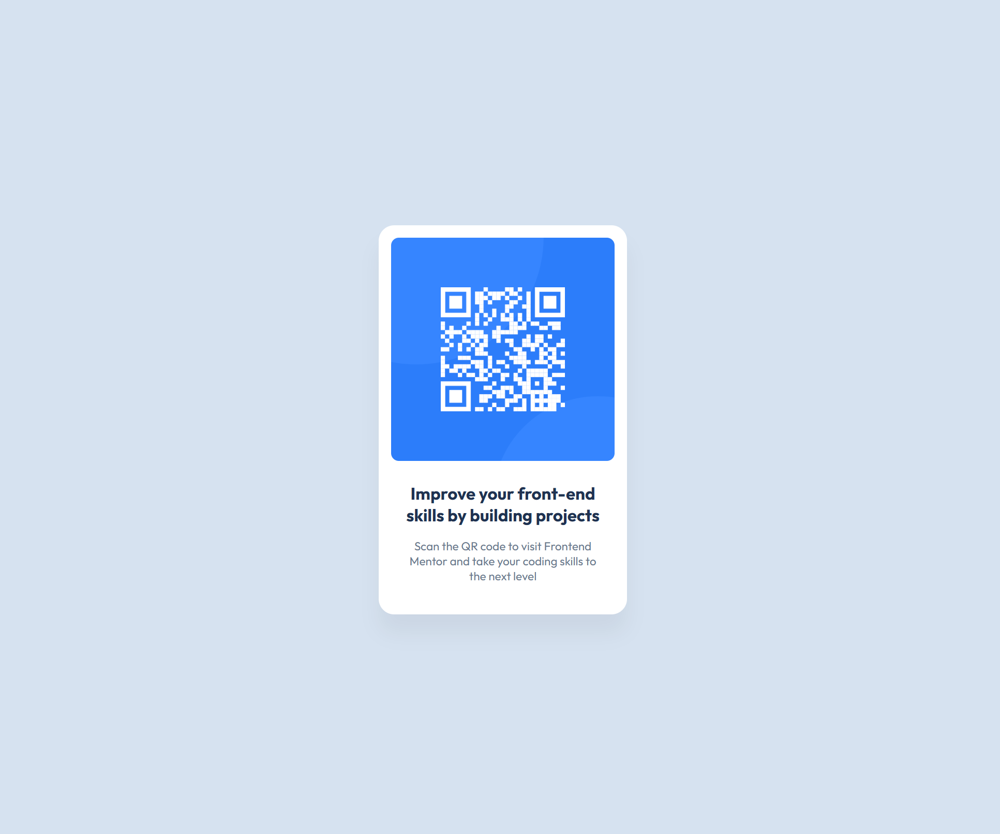

# Frontend Mentor - QR code component solution

This is a solution to the [QR code component challenge on Frontend Mentor](https://www.frontendmentor.io/challenges/qr-code-component-iux_sIO_H). Frontend Mentor challenges help you improve your coding skills by building realistic projects.

## Table of contents

- [Overview](#overview)
  - [Screenshot](#screenshot)
  - [Links](#links)
- [My process](#my-process)
  - [Built with](#built-with)
  - [What I learned](#what-i-learned)
- [Author](#author)

## Overview

### Screenshot

### Links

- Solution URL: [Add solution URL here](https://your-solution-url.com)
- Live Site URL: [https://smgr7.github.io/qrcode-component/]

## My process

### Built with

- HTML5
- CSS
- Flexbox

### What I learned

I've learned how to create a responsive layout using Flexbox and precise visual styling. It's a great exercise for beginners.

## Author

- Frontend Mentor - [@smgr7](https://www.frontendmentor.io/profile/smgr7)
